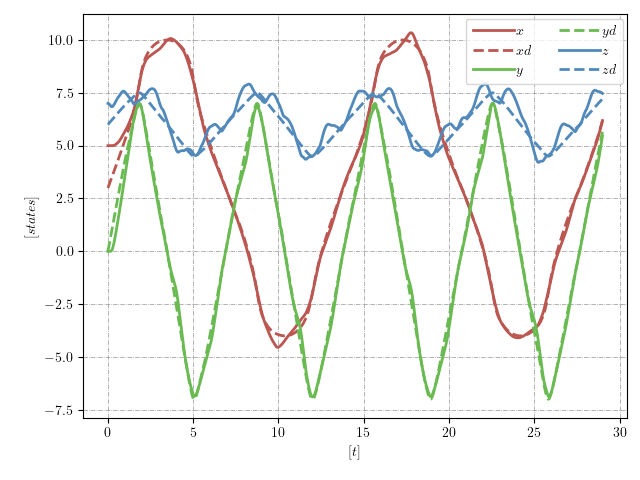
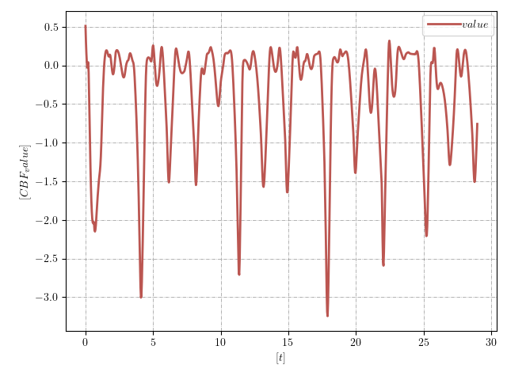
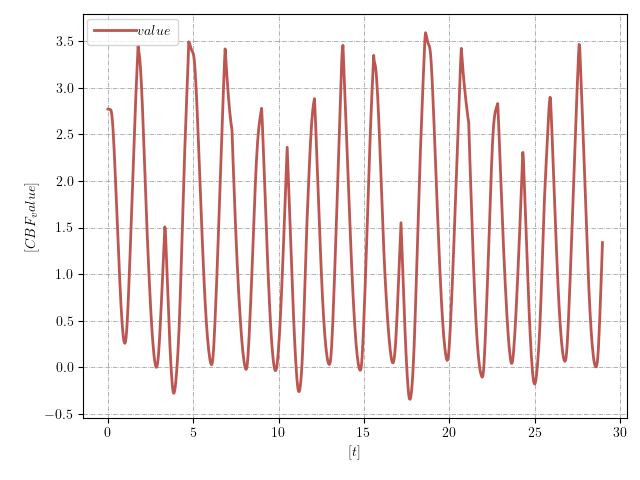

# MPCC_CLF_CBF

This repository contains the implementation of a Model Predictive Contouring Control (MPCC) framework that integrates Control Lyapunov Functions (CLF) and Control Barrier Functions (CBF) for stable and safe path-following in quadcopter systems. The controller minimizes contouring and lag errors while ensuring system stability and obstacle avoidance through CLF and CBF constraints. The code is designed for real-time applications with configurable prediction horizons.

Key visual outputs include:

### UAV Pose

### Control Lyapunov Functions (CLF)

### Control Barrier Functions (CBF)

